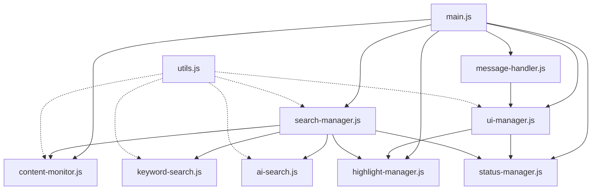

# SmartFind Content Script Refactoring Summary

## Overview

Successfully refactored the monolithic `content.js` (1,948 lines) into a well-organized modular architecture with 9 focused modules totaling approximately the same functionality but with dramatically improved maintainability.

## What Was Done

### 1. Architectural Analysis
- Identified distinct responsibilities within the original monolithic file
- Mapped dependencies between different functional areas
- Designed a clean module hierarchy with proper separation of concerns

### 2. Module Creation
Created 9 specialized modules in `src/content/`:

| Module | Lines | Responsibility |
|--------|-------|----------------|
| `main.js` | ~80 | Entry point and module coordination |
| `utils.js` | ~180 | Shared utility functions |
| `content-monitor.js` | ~340 | Page content extraction and monitoring |
| `ui-manager.js` | ~260 | Search bar UI and user interactions |
| `search-manager.js` | ~200 | Search strategy coordination |
| `highlight-manager.js` | ~180 | DOM highlighting and navigation |
| `status-manager.js` | ~140 | Status messages and payment UI |
| `message-handler.js` | ~60 | Background script communication |
| `keyword-search.js` | ~160 | Keyword search engine |
| `ai-search.js` | ~380 | AI search result processing |

### 3. Dependency Management
- Implemented clean dependency injection through constructors
- Established clear communication patterns between modules
- Removed global state where possible, moving to managed state

### 4. Configuration Updates
- Updated `manifest.json` to use the new modular entry point
- Added ES6 module support with `"type": "module"`
- Maintained backward compatibility during transition

## Key Improvements

### ✅ Maintainability
- **Single Responsibility**: Each module has one clear purpose
- **Focused Changes**: Modifications only affect relevant modules
- **Easier Debugging**: Issues can be isolated to specific modules

### ✅ Scalability  
- **New Features**: Can be added as new modules without touching existing code
- **Team Development**: Multiple developers can work on different modules simultaneously
- **Code Reuse**: Modules can be imported and reused in other parts of the extension

### ✅ Testability
- **Unit Testing**: Each module can be tested in isolation
- **Mock Dependencies**: Easy to mock dependencies for testing
- **Clear Interfaces**: Well-defined public APIs for each module

### ✅ Code Quality
- **Reduced Complexity**: No more 2000-line files to navigate
- **Clear Structure**: Easy to understand what each file does
- **Modern Patterns**: Uses ES6 modules and classes consistently

## Module Interactions

## Migration Benefits

1. **Developer Experience**: Much easier to find and modify specific functionality
2. **Bug Isolation**: Issues are contained within specific modules
3. **Performance**: Modules can be optimized independently
4. **Documentation**: Each module can have focused documentation
5. **Code Reviews**: Smaller, focused changes are easier to review

## Future Enhancements Made Possible

This modular structure enables:
- **A/B Testing**: Different search strategies can be easily swapped
- **Plugin Architecture**: New search engines can be added as modules
- **Performance Monitoring**: Module-level performance tracking
- **Feature Flags**: Individual modules can be enabled/disabled
- **Lazy Loading**: Modules can be loaded on-demand

## Backward Compatibility

- Original `content.js` is preserved but marked as deprecated
- All existing functionality is maintained
- No breaking changes to the extension API
- Smooth transition with rollback capability if needed

## Next Steps

1. **Testing**: Comprehensive testing of the modular architecture
2. **Documentation**: Update developer documentation to reflect new structure  
3. **Monitoring**: Watch for any issues during the transition period
4. **Optimization**: Identify opportunities for further performance improvements
5. **Team Training**: Ensure all developers understand the new architecture 